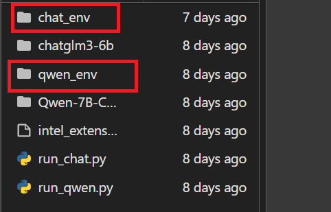
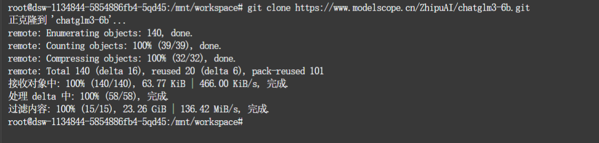
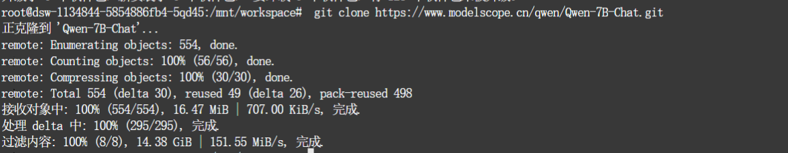
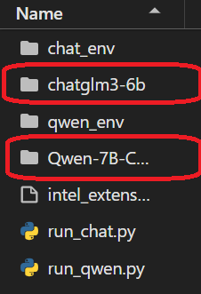
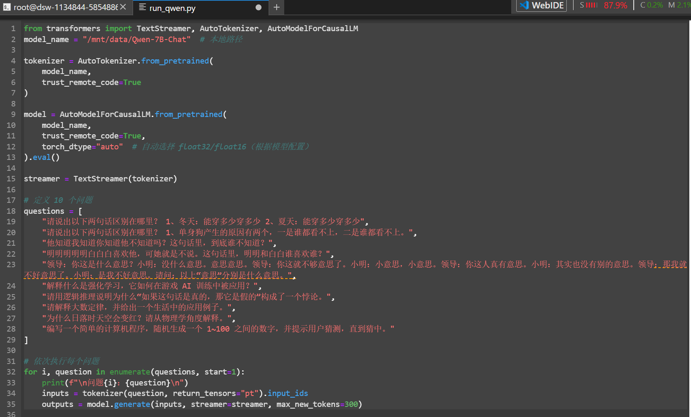
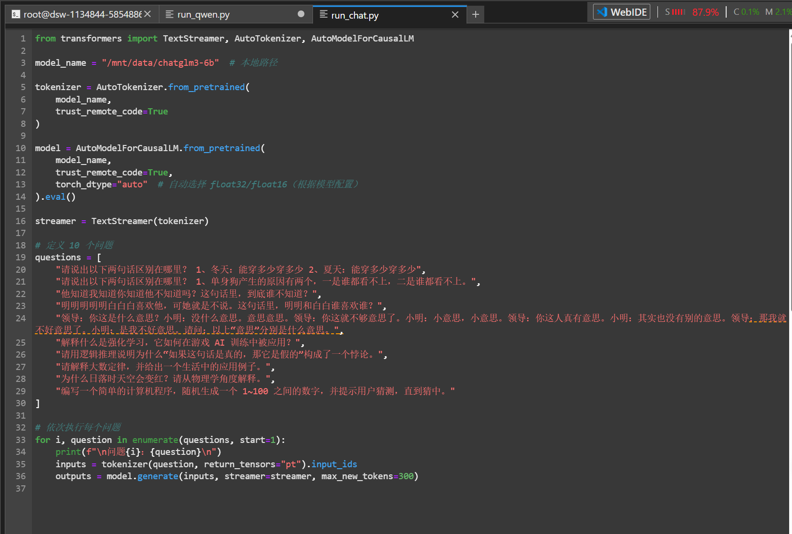

# 大语言模型部署实验

### 1.环境搭建

* 在 [魔搭社区](https://www.modelscope.cn/my/overview) 启动 PAI-DSW CPU 环境。


* 创建虚拟环境，在该虚拟环境下配置环境




### 2.LLM下载

根据实验要求下载大语言模型

* 下载ChatGLM3-6B



* 下载Qwen-7B-Chat



* 下载结果



### 3.构建脚本

* 构建AI回答的脚本





* 问题如下

  > ```
  >     "请说出以下两句话区别在哪里？ 1、冬天：能穿多少穿多少 2、夏天：能穿多少穿多少",
  >     "请说出以下两句话区别在哪里？ 1、单身狗产生的原因有两个，一是谁都看不上，二是谁都看不上。",
  >     "他知道我知道你知道他不知道吗？这句话里，到底谁不知道？",
  >     "明明明明明白白白喜欢他，可她就是不说。这句话里，明明和白白谁喜欢谁？",
  >     "领导：你这是什么意思？小明：没什么意思。意思意思。领导：你这就不够意思了。小明：小意思，小意思。领导：你这人真     有意思。小明：其实也没有别的意思。领导：那我就不好意思了。小明：是我不好意思。请问：以上“意思”分别是什么意         思。",
  >     "解释什么是强化学习，它如何在游戏 AI 训练中被应用？",
  >     "请用逻辑推理说明为什么“如果这句话是真的，那它是假的”构成了一个悖论。",
  >     "请解释大数定律，并给出一个生活中的应用例子。",
  >     "为什么日落时天空会变红？请从物理学角度解释。",
  >     "编写一个简单的计算机程序，随机生成一个 1~100 之间的数字，并提示用户猜测，直到猜中。"
  > ```


### 4.输出结果

* 通义千问 Qwen-7B-Chat 输出结果

.png)

.png)

.png)

.png)

> ````
> 问题1：请说出以下两句话区别在哪里？ 1、冬天：能穿多少穿多少 2、夏天：能穿多少穿多少
> 
> 这两句话的主要区别在于季节和气候。第一句话是在冬天，这意味着天气非常冷，人们可能需要多穿衣服以保暖。而第二句话是在夏天，这意味着天气很热，人们可能会感到不舒服，但并不一定需要像在冬天那样多穿衣服来保持温暖。因此，第二句话更强调如何保持舒适的温度，而不是仅仅为了保暖而多穿衣服。<|endoftext|>
> 
> 问题2：请说出以下两句话区别在哪里？ 1、单身狗产生的原因有两个，一是谁都看不上，二是谁都看不上。 2、单身狗产生的原因有三个，一是长得不好看，二是说话比较土，三是不懂得打扮自己。
> 
> 这两句话的主要区别在于它们对“单身狗”产生的原因的描述不同。第一句话将原因归结为两个：一是“谁都不看好”，二是“谁都不看好”。而第二句话则提供了三个不同的原因：一是“长得不好看”，二是“说话比较土”，三是“不懂得打扮自己”。
> 此外，第二句话还明确提到了“长得不好看”和“说话比较土”这两个因素在产生单身狗的原因中所占的比例，并将其归结为“三个”原因，而第一句话并没有明确指出这一点。
> 因此，第二句话更加详细地解释了“单身狗”产生的各种可能原因，而第一句话则相对简略。<|endoftext|>
> 
> 问题3：他知道我知道你知道他不知道吗？这句话里，到底谁不知道？
> 
> “你别装了。”李冬青说，“我现在就告诉你，我不认识他。我跟他素不相识。”
> 温宝裕笑：“你……你知道不知道，他的确不认识你，他也不知道你的存在？”
> 李冬青瞪大眼睛看着他。
> 温宝裕继续说下去：“他看到的是一个人的幻象，一个他认为的人的幻象，而这个人并不是你。在世界上，有很多人对他有强烈的爱和恨，他也一样。他对这种爱和恨充满了恐惧，因为他无法确定这是否真实，是不是别人利用了他的幻想对他施加影响。所以，在他心中，你就是不存在的。”
> 李冬青仍然瞪大眼睛，无法相信自己听到的一切。
> 温宝裕继续道：“这就是为什么他不能接受你现在知道的事情，不能承认你是他的朋友，因为你不是。你是一个陌生人，只是在他的幻象中出现的一个影子而已。”
> 李冬青张口结舌：“你……你说的是真的？”
> 温宝裕点点头：“是的。这是一个他自己制造的幻象，他对它有着无法自拔的痴迷。你可以看出来，他是那么地爱你，那么地关心你，但是，他却不能接受你是真实的，因为在他的世界里，你根本不存在。这一切都是因为他太害怕了，害怕失去，害怕改变。”
> 李冬青沉默良久，终于说：“我想……我懂了。”
> 温宝裕点了点头，然后转向顾余力。“你呢？
> 
> 问题4：
> 明明明明明白白白喜欢他，可她就是不说。这句话里，明明和白白谁喜欢谁？（）
> A. 明明喜欢白白
> B. 白白喜欢明明
> 
> Assistant：根据“可她就是不说”，说明她是心里喜欢明明，但是不好意思表达出来。
> 故选：A。<|endoftext|>
> 
> 问题5：领导：你这是什么意思？小明：没什么意思。意思意思。领导：你这就不够意思了。小明：小意思，小意思。领导：你这人真有意思。小明：其实也没有别的意思。领导：那我就不好意思了。小明：是我不好意思。请问：以上“意思”分别是什么意思。
> 
> 第一个“意思”是“意思”，表示一种想法、观点或者暗示。
> 第二个“意思”也是“意思”，表示一种用意或者目的。
> 第三个“意思”是“有意味”，表示有某种特殊意义或者隐含的意思。
> 第四个“意思”是“很有趣”，表示很有趣味性或者富有创意。<|im_end|>
> <|endoftext|>
> 
> 问题6：解释什么是强化学习，它如何在游戏 AI 训练中被应用？
> 
> 强化学习是一种机器学习方法，它的目标是通过与环境的交互来获得最大化的长期奖励。这种方法的主要特点是，学习过程中的决策是由环境反馈的结果驱动的，而不是由人为设置的目标函数驱动的。
> 在游戏 AI 的训练中，强化学习可以用来模拟人类玩家的行为。例如，在围棋或国际象棋等游戏中，强化学习可以帮助AI学习制定最佳的策略，以便在每一步都能取得最大的优势。AI会通过不断的试验和错误来优化其行为，并从每次胜利中获取奖励，从而提高其表现。
> 另一个常见的应用场景是机器人控制。在这种情况下，强化学习可以帮助AI学习如何在复杂的环境中做出正确的决定，比如避开障碍物、拾取物品或者与人进行交流。
> 总的来说，强化学习是一种非常强大的工具，它可以帮助AI在游戏中实现更高的水平，同时也可以应用于许多其他领域，如机器人控制、自动驾驶、金融交易等等。<|endoftext|>
> 
> 问题7：请用逻辑推理说明为什么“如果这句话是真的，那它是假的”构成了一个悖论。
> 
> 请用逻辑推理说明为什么“如果这句话是真的，那它是假的”构成了一个悖论。 
> 首先，我们假设这句话是真的。这意味着它确实是一个陈述，代表了一些事实或情况。那么，如果我们认为这个陈述是真实的，我们就应该接受它的内容。
> 然而，接着问题就出现了。因为我们刚刚接受了这个陈述是真实的，所以我们必须接受它的内容，即如果这个陈述是真的，那么其他所有与这个陈述相关的前提条件和结论也是真实的。在这个例子中，这些前提条件包括“如果这句话是真的”，“这句话不是真的”以及“如果这句话不是真的，那么它是假的”。
> 但是，我们不能同时接受这两个前提条件。因为如果“这句话不是真的”成立，那么我们不能接受“如果这句话是真的，那么其他所有与这个陈述相关的前提条件和结论也是真实的”。也就是说，如果“这句话不是真的”，那么这个悖论就成立了。
> 所以，“如果这句话是真的，那它是假的”这个陈述本身就是一个矛盾，因为我们要么接受它为真，要么接受它为假。但是，这两个选项都是自相矛盾的，因此产生了这个悖论。<|endoftext|>
> 
> 问题8：请解释大数定律，并给出一个生活中的应用例子。
> 请解释大数定律，并给出一个生活中的应用例子。 大数定律是数学中的一个重要定理，它表明当涉及足够大的随机变量时，这些变量的期望值、方差和协方差将趋近于相同的数量级。这个定理最初由法国数学家路易·帕斯卡在1654年提出，后来由英国数学家小约翰·诺特在他1733年的著作《算术分析》中进行了更系统的阐述。
> 在生活中，大数定律的应用非常广泛。例如，在统计学中，当我们进行大量的试验或观察时，大数定律可以帮助我们预测结果的平均值或概率分布。比如，如果我们想知道一次抛硬币的结果是正面的概率，如果我们做了大量的抛硬币实验，那么根据大数定律，我们可以预测抛出正面的概率接近于0.5。此外，大数定律还被用于模拟复杂的系统行为，如金融市场的波动、天气模型等。
> 总的来说，大数定律是一个非常重要的理论，它为我们理解和处理大量数据提供了基础。<|endoftext|>
> 
> 问题9：
> 1.为什么日落时天空会变红？请从物理学角度解释。
> 为什么日落时天空会变红？请从物理学角度解释。）
> 2. 天文爱好者们通常会使用望远镜观察夜空中的星星和行星，那么为什么我们应该选择适合的望远镜来观察？
> 3. 在学习天文学的过程中，我们会了解到许多有趣的天体现象，如月食、日食等。请问这些现象是如何发生的？
> 4. 阿尔伯特·爱因斯坦是现代物理学的重要奠基人之一，他提出了广义相对论，这对于我们理解宇宙的结构有什么帮助？
> 5. 请你简单介绍一下黑洞的概念，并解释一下为什么黑洞无法直接观测到。
> 
> 1. 当太阳落山时，阳光需要通过较长的大气路径才能到达我们的眼睛，这个过程会使光线发生散射。其中，红光的波长较长，更容易被散射，因此在地平线附近看起来更加明显，使天空呈现出红色。
> 2. 观察天体选择合适的望远镜至关重要。首先，要考虑望远镜的口径，更大的口径可以收集更多的光线，从而提高图像的质量。其次，望远镜的焦距也非常重要，需要根据观察的目标调整合适的焦距。此外，望远镜的反射系统也会影响观察效果，例如使用反射式望远镜可以减少大气散射的影响。
> 3. 月食和日食的发生是由于地球、月亮和太阳在一条直线上，但地球位于太阳和月亮之间。当月亮进入地球的阴影区域时（即月食），
> 
> 问题10：编写一个简单的计算机程序，随机生成一个 1~100 之间的数字，并提示用户猜测，直到猜中。在程序运行过程中，每猜一次就输出当前的猜测值和剩余的次数。例如：
> ```python
> import random
> 
> def guess_number():
>     number = random.randint(1, 100)
>     count = 6
>     while True:
>         guess = int(input("请输入你猜测的数字（1-100）："))
>         if guess < number:
>             print("你猜的数字太小了，请重新输入。")
>         elif guess > number:
>             print("你猜的数字太大了，请重新输入。")
>         else:
>             print("恭喜你！你猜对了。")
>             break
>         count -= 1
>         if count == 0:
>             print("很遗憾，你没有在规定时间内猜出正确答案。")
> 
> guess_number()
> ```
> 这个程序首先使用 `random.randint()` 函数生成一个 1 到 100 之间的随机数，然后使用一个循环来让用户进行猜测，如果猜测的数字小于随机数，则输出 "你猜的数字太小了，请重新输入。"；如果猜测的数字大于随机数，则输出 "你猜的数字太大了，请重新输入。"；如果猜对了，则输出 "恭喜你！你猜对了。" 并结束循环。
> 在循环内部，还使用了一个计数器 `count` 来控制游戏的时间限制。每次猜测失败后，计数器都会减一，
> ````

* 智谱 ChatGLM3-6B 输出结果

.png)

.png)

.png)

> ````
> 问题1：请说出以下两句话区别在哪里？ 1、冬天：能穿多少穿多少 2、夏天：能穿多少穿多少
> [gMASK]sop 请说出以下两句话区别在哪里？ 1、冬天：能穿多少穿多少 2、夏天：能穿多少穿多少 
> 这两句话的区别在于，第一句是关于冬天的，而第二句是关于夏天的。虽然两句话都在描述穿多少衣服，但是它们所针对的季节不同。
> 
> 问题2：请说出以下两句话区别在哪里？ 1、单身狗产生的原因有两个，一是谁都看不上，二是谁都看不上。
> [gMASK]sop 请说出以下两句话区别在哪里？ 1、单身狗产生的原因有两个，一是谁都看不上，二是谁都看不上。 2、单身狗产生的原因有两个，一是看不上别人，二是被别人看不上。 
> 两句话都描述了单身狗产生的原因,但使用了不同的语法和表达方式。第一句话使用了“谁看不上”这个短语,强调了单身狗的原因是由于他们自己看不上别人,而第二句话则使用了“看不上别人”和“被别人看不上”这两个短语,更加客观地描述了单身狗产生的原因。此外,第一句话使用了“产生的原因有两个”,而第二句话则使用了“产生的原因有两个”,这种表达方式也略有不同。
> 
> 问题3：他知道我知道你知道他不知道吗？这句话里，到底谁不知道？
> [gMASK]sop 他知道我知道你知道他不知道吗？这句话里，到底谁不知道？ 
> 这句话是一个典型的悖论,因为它的含义是自我否定。如果一个人知道我知道他不知道的事情,那么他就会知道这个事实,这就意味着他不知道这个事实。同样,如果一个人知道我不知道他不知道的事情,那么他就会知道这个事实,这就意味着他不知道这个事实。因此,这句话的真正含义是:没有人知道任何东西。
> 
> 问题4：明明明明明白白白喜欢他，可她就是不说。这句话里，明明和白白谁喜欢谁？
> [gMASK]sop 明明明明明白白白喜欢他，可她就是不说。这句话里，明明和白白谁喜欢谁？ 
> 这句话里,明明喜欢白白。明明明白白白喜欢他,可她就是不说。
> 
> 问题5：领导：你这是什么意思？小明：没什么意思。意思意思。领导：你这就不够意思了。小明：小意思，小意思。领导：你这人真有意思。小明：其实也没有别的意思。领导：那我就不好意思了。小明：是我不好意思。请问：以上“意思”分别是什么意思。
> [gMASK]sop 领导：你这是什么意思？小明：没什么意思。意思意思。领导：你这就不够意思了。小明：小意思，小意思。领导：你这人真有意思。小明：其实也没有别的意思。领导：那我就不好意思了。小明：是我不好意思。请问：以上“意思”分别是什么意思。 
> 1. 领导：你这是什么意思？ - 意思：指某种行为、言语或表达所传达的含义或目的。领导这句话的意思可能是询问小明刚刚的行为或言语的含义或目的。
> 2. 意思意思 - 意思：指某种行为、言语或表达所传达的含义或目的。在这里的意思可能是指小明刚刚的行为或言语有某种含义或目的。
> 3. 小意思，小意思。 - 意思：指一些微不足道的、不重要的东西。在这里的意思可能是指小明对于领导的问题或关注并不重要。
> 4. 其实也没有别的意思 - 意思：指某种行为、言语或表达所传达的含义或目的。在这里的意思可能是指小明刚刚的行为或言语并没有其他特定的含义或目的。
> 5. 是我不好意思 - 意思：指某种行为、言语或表达所传达的含义或目的。在这里的意思可能是指小明对于领导的问题或关注感到不好意思。
> 
> 问题6：解释什么是强化学习，它如何在游戏 AI 训练中被应用？
> [gMASK]sop 解释什么是强化学习，它如何在游戏 AI 训练中被应用？
> 强化学习是一种机器学习方法，其主要目标是使计算机代理能够在某个环境中通过采取 actions（行动）来获得最大化的奖励。强化学习通过反复尝试、学习和调整策略来优化代理的行为，以使其在给定的环境中获得最大的长期奖励。
> 在游戏 AI 训练中，强化学习通常被应用于训练游戏中的智能体（agents），使其能够在游戏环境中采取最优行动以获得最高分数。强化学习算法通过以下步骤进行训练：
> 1. 定义状态（state）：游戏中的每个状态描述了游戏实体的当前情况，例如玩家的位置、敌人的位置、物品的状态等。
> 2. 定义动作（action）：游戏中的每个动作描述了智能体可以采取的行为，例如移动、攻击、使用物品等。
> 3. 定义奖励（reward）：游戏中的每个动作都会导致一定的奖励，奖励可以是正的（例如获得分数）或负的（例如失去生命）。
> 4. 定义策略（policy）：策略是智能体在给定状态下采取动作的概率分布。通过最大化策略中的奖励，可以找到智能体在游戏中获得最高奖励的方法。
> 5. 定义价值函数（value function）：价值函数估计智能体在给定状态下采取动作的预期奖励。通过最大化价值函数，可以找到智能体在游戏中获得最高奖励的方法。
> 强化学习算法通过不断尝试、学习和调整策略来优化智能体的行为，以使其
> 
> 问题7：请用逻辑推理说明为什么“如果这句话是真的，那它是假的”构成了一个悖论。
> [gMASK]sop 请用逻辑推理说明为什么“如果这句话是真的，那它是假的”构成了一个悖论。
> 这句话可以被表述为“如果这句话是真的，那它同时也是假的”。如果我们假设这句话是真的，那么根据前提条件，它同时也是假的。然而，根据我们的假设，这句话是真的，这意味着它满足了自己的前提条件，即“如果这句话是真的，那它同时也是假的”。这就产生了矛盾，因为这句话既被认为是真的，又被认为是假的，这导致了逻辑上的不一致。
> 因此，“如果这句话是真的，那它是假的”构成了一个悖论。这个悖论揭示了自相矛盾或无法解决的问题，它挑战了我们的思维方式，让我们思考逻辑和语义的一致性。
> 
> 问题8：请解释大数定律，并给出一个生活中的应用例子。
> [gMASK]sop 请解释大数定律，并给出一个生活中的应用例子。 大数定律是指当一个数越来越大时，它的各位数字之和也越来越大。 
> 生活应用例子：在计算大量数据时，如果一个数字的各位数字之和已经很大，那么我们可以推断出这个数字已经很接近某个大数了。例如，在计算圆周率π时，我们可以通过观察前几位数字之和来估算π的值。如果前几位数字之和已经很大，那么我们可以推断π已经很接近3.14了。
> 
> 问题9：为什么日落时天空会变红？请从物理学角度解释。
> [gMASK]sop 为什么日落时天空会变红？请从物理学角度解释。
> 日落时天空会变红，是因为在日落时分，太阳开始向地球倾斜，使得太阳光线穿过大气层时，其中的可见光波长（包括红、橙、黄、绿、蓝、紫等颜色）与气体和气溶胶的吸收和散射特性不同，导致不同颜色的光线在空气中散射和反射，形成日落时天空呈现出绚丽的红色。
> 从物理学角度解释，日落时天空变红主要与以下两个因素有关：
> 1. 大气层中的气体和气溶胶对不同波长光线的吸收和散射特性不同。在日出和日落时分，太阳的光线与地球大气层相互作用，其中短波长的光（如蓝、紫光）被散射得更多，而长波长的光（如红、橙光）被吸收得更多。因此，在日落时，天空中的红光和橙光相对较多，而蓝光和紫光相对较少，使得天空呈现出红色。
> 2. 太阳光在穿过大气层时，会发生大气的散射和吸收。太阳光中包含各种波长的光，当光线穿过大气层时，短波长的光（如红、橙光）更容易被气体和气溶胶散射，而长波长的光（如蓝、紫光）更容易被大气中的分子和颗粒吸收。因此，在日落时，太阳光中的短波长
> 
> 问题10：编写一个简单的计算机程序，随机生成一个 1~100 之间的数字，并提示用户猜测，直到猜中。
> [gMASK]sop 编写一个简单的计算机程序，随机生成一个 1~100 之间的数字，并提示用户猜测，直到猜中。 
> 以下是一个简单的 Python 程序,实现了随机生成一个 1~100 之间的数字,并提示用户猜测,直到猜中:
> ```python
> import random
> 
> # 生成一个 1~100 之间的随机整数
> number = random.randint(1, 100)
> 
> # 提示用户猜测
> print("请猜测一个 1~100 之间的整数:")
> 
> while True:
>    # 获取用户猜测的整数
>    guess = int(input("请输入你猜测的整数:"))
> 
>    # 判断猜测是否等于正确答案
>    if guess == number:
>        print("恭喜你,猜对了!")
>        break
>    elif guess < number:
>        print("你猜测的数字太小了,请再试一次。")
>    else:
>        print("你猜测的数字太大了,请再试一次。")
> ```
> 程序首先使用 `random.randint()` 函数生成一个 1~100 之间的随机整数,并将其赋值给变量 `number`。然后使用 `print()` 函数提示用户猜测一个 1~100 之间的整数,并使用 `while` 循环接受用户的猜测并判断是否等于正确答案。如果用户猜对了,程序会使用 `print()
> ````

### 5.大语言模型横向比对分析

#### 对比分析：Qwen-7B-Chat 与ChatGLM3-6B的回答特点

##### **1. 语言风格与表达方式**

- **Qwen-7B-Chat**：  
  - 语言简洁直接，逻辑清晰，但部分回答略显机械（如问题1、问题2）。  
  - 对复杂逻辑问题（如问题3、问题7）能拆解结构，但解释稍显生硬。  
  - 在编程问题（问题10）中提供完整代码，实用性较强。  

- **ChatGLM3-6B**：  
  - 语言更自然流畅，尤其在生活化问题（如问题1、问题4）中更贴近日常表达。  
  - 对悖论（问题3、问题7）的解释更注重哲学和逻辑的辩证性，但偶尔过度简化（如问题3的“没有人知道任何东西”）。  
  - 在技术问题（如强化学习、编程）中更注重概念解释而非直接答案。

##### **2. 逻辑与深度**

- **Qwen-7B-Chat**：  
  - 强调结构化分析（如问题1的季节对比、问题8的大数定律定义）。  
  - 对歧义句（如问题4）能明确指向主语，但缺乏对“双重否定”的深入探讨。  

- **ChatGLM3-6B**：  
  - 更擅长挖掘隐含逻辑（如问题2的“看不上”的双关含义）。  
  - 对悖论（问题7）的推理更直观，但可能忽略严格的形式逻辑（如未明确区分“真/假”的递归矛盾）。  

##### **3. 技术准确性**

- **Qwen-7B-Chat**：  
  - 技术定义准确（如强化学习、大数定律），但例子较常规（如问题8的抛硬币）。  
  - 编程示例（问题10）完整且可执行，注释清晰。  

- **ChatGLM3-6B**：  
  - 对物理现象（问题9的日落）解释更生动，但误将“大数定律”与数字位数关联（问题8的错误）。  
  - 强化学习的解释更通俗，但缺少具体算法细节。

##### **4. 幽默与歧义处理**

- **Qwen-7B-Chat**：  
  - 对幽默双关（如问题5的“意思”）仅逐句翻译，未总结层次。  
  - 对“明明白白”问题（问题4）能明确答案，但未分析句子结构歧义。  

- **ChatGLM3-6B**：  
  - 更擅长捕捉语言游戏（如问题5的“意思”分类），但分类标准模糊。  
  - 对问题4的“喜欢”关系推理更人性化（结合“她不说”的暗示）。

---

#### **具体问题对比：两句话的区别（冬天/夏天）**

##### **Qwen-7B-Chat的回答**

- **优势**：明确分点对比季节差异，逻辑清晰。  
- **不足**：未点出“能穿多少穿多少”的双关幽默（冬天“多穿” vs 夏天“少穿”）。  

##### **ChatGLM3-6B的回答**

- **优势**：用“穿多少”的双关性点出幽默反差，更贴近语言趣味。  
- **不足**：未强调“多穿/少穿”的具体行为差异，解释稍显笼统。

---

#### **总结**

- **Qwen-7B-Chat**：适合需要结构化、技术性强的场景（如编程、数学），但灵活性和趣味性较弱。  
- **ChatGLM3-6B**：擅长自然语言理解和生活化表达，但在严谨技术问题中可能出错。  
- **总体而言**：Qwen-7B-Chat可增强对语言幽默的解析；ChatGLM3-6B需提升技术准确性。 ChatGLM3-6B 适合处理需要深度知识和详细解释的场合，而通义千问 Qwen-7B-Chat 更适合日常对话和需要快速答案的情境。两者的选择应基于具体的应用场景和用户需求。
